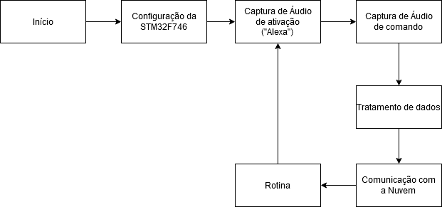

# Mapurunga_Alexa
Trabalho final da disciplina microcontroladores.

[Repositório do código](https://github.com/luizrenault/stm32-vs4a)

# Descrição do Projeto
Esse projeto tem como objetivo utilizar o microcontrolador STM32F746 para criar um ambiente capaz de integrar essa placa com uma Alexa virtual. 
Com esse ambiente, seria possível estabelecer uma conexão com a Internet das Coisas e o  microcontrolador, tornando possível criar projetos de diversas aplicações como:

* Carros inteligentes
* Relógios inteligentes
* Otimização de tarefas
* Monitoramento
* Compras
* Fácil acesso a informações
* Realizar tarefas por comando de voz

**Microcontrolador utilizado:**
**STM32F746**

## Periféricos

## Fluxograma

## Pinagem
[Planilha de PINOS](https://docs.google.com/spreadsheets/d/1Sw0a9_pRrKhN5JRSCNtv-Qpn41waan8Ut9J1HC0hoy8/)

